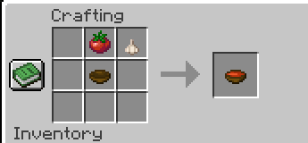

# Harvest Mod
Harvest Mod is a Minecraft harvesting mod that adds a lot of new stuff like new crops, mobs, and items.<br>
Made with <3 by Mustafa & Nullskulls.

## Items
You can find all the items in the creative inventory under the "Harvest Mod" tab,

- **Tomato** - Edible and can be used as an ingredient for crafting.
- **Tomato Seed** - Can be planted to grow TomaTOES.
- **Tomato Soup** - Edible and can be crafted using [This Recipe](https://github.com/MustafaBioS/harvest-mod/blob/main/README.md#Recipes).
- **Garlic** - Stinky, will cause hunger and will not give you any hunger bars back.
- **Garlic Seed** - Can be planted to grow Garlic.
- **Mustafa Spawn Egg** - Used to spawn the Mustafa variant of the Crop Thief entity.
- **Nullskulls Spawn Egg** - Used to spawn the Nullskulls variant of the Crop Thief entity.
- **Harvester Block** - A block that can be used to sacrifice your hoe to automatically harvest crops.
- **Planter Block** - A block that can be used to sacrifice your hoe to automatically plant crops.


## Recipes
You can also craft the "Tomato Soup" item using the following recipe:

```
Tomato + Garlic + Bowl = Tomato Soup
```

**in the following pattern:**



there will be more recipes soon once we make updates to this mod.

## Entities

### Crop Thief
We currently only have the "Crop Thief" entity with the Mustafa variant, and the Nullskulls variant, which 
chases after your crops destroying them and stealing them, you can get your crops back by killing them.
Spawn them by using the spawn eggs in the creative inventory.

## Setup

For setup instructions, please see the [Fabric Documentation page](https://docs.fabricmc.net/develop/getting-started/creating-a-project#setting-up) related to the IDE that you are using.

## License

This template is available under the CC0 license. Feel free to learn from it and incorporate it in your own projects.

